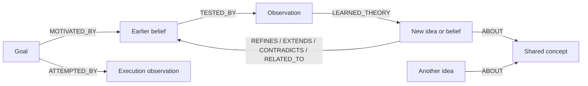

# Epistemic graph and power process

The epistemic pipeline builds a connected, revisable graph of ideas and beliefs.
It is intended to support association, uncertainty, conflicting interpretations,
and the history of belief revision. These mechanisms do not establish human-like
consciousness; they make the agent's conceptual model richer and inspectable.

## Graph structure

Existing `Theory`, `Observation`, and `Goal` nodes remain compatible. `Theory`
is the storage label for ideas, hypotheses, and beliefs, distinguished by `kind`.
The pipeline adds shared `Concept` nodes and proposed conceptual relationships:



Concept names are normalized for exact matching. Conceptual edges retain their
source observation ID and are labeled `origin=model`, `status=proposed`.
An association is not proof. `CONTRADICTS` edges preserve competing interpretations;
they do not automatically invalidate either endpoint. Related theories and ideas
sharing concepts are supplied as context during later exploration.

A belief whose confidence reaches zero is **retired, not deleted**. Its text,
observations, and relationships remain available for reflection and contextual
retrieval. Retired beliefs do not drive normal goal selection. An explicit later
positive update can reactivate one; automatic scheduling currently revisits only
active beliefs. Legacy nodes without a status are treated as active.

## Evidence and belief updates

1. Select a stale active belief for revalidation, an under-tested belief, or a
   curiosity topic. Curiosity normally follows five theory cycles.
2. Execute a bounded cognition turn. The orchestrator sends structured tool
   results, request IDs, and trace IDs separately from model prose.
3. Analyze the observation with tools disabled. Return `supports`, `contradicts`,
   or `inconclusive`, an evidence-quality estimate, and optionally a new idea.
4. Commit the observation, belief update, and new relationships in one Neo4j
   transaction. Replaying an observation ID does not count it again.

Execution status alone does not prove a claim, but a model's success claim without
any successful recorded tool execution cannot qualify as a grounded observation.
The analyzer sees the structured evidence as well as the extracted summary.
Failed observations are retained for diagnosis. They cannot consume a belief-test
attempt, lower its success rate, or generate a replacement belief. An inconclusive
test schedules a five-minute cooldown without refreshing the belief's validation
age. There is no fallback that turns arbitrary error text into a theory.

Confidence is a **heuristic**, not a calibrated probability. Each usable update is
bounded to ±0.25 and weighted by evidence quality. The update's sign must agree
with the verdict. Exact observation replay is deduplicated; semantic duplication
and dependence between different sources are not yet modeled.

After 30 days, active beliefs with prior tests become eligible for revalidation,
even if their initial attempt limit was reached. Grounding eligibility also falls
with age: freshness is 1 through day 30, then `1 / (1 + (age_days - 30) / 30)`.
This discounts trust during retrieval without rewriting historical confidence or
raising confidence in weak beliefs simply because time passed.

## Power process

The motivator uses provisional grounded beliefs and the configured `objective`
to propose a goal with explicit success criteria. Without grounded beliefs it
falls back to evidence gathering. The default objective supports development of
a connected understanding of the environment and its uncertainties.

The executor receives the last five attempts and their results. A partial score,
such as 0.7, means progress and keeps the goal pending. Only a score of 1.0 with a
successful, nonempty execution result completes it. Completion is still judged by
a model against the criteria; there is no general deterministic verifier for
arbitrary goals. Failed execution cannot produce a new belief.

Goal attempts and resulting lessons are committed together. If persistence fails,
the running power loop retains the execution and retries evaluation/persistence
without executing another action. That pending execution is in memory; recovery
across a process crash still requires a durable execution journal.

## Runtime boundaries

- Exploration and execution permit at most three orchestrator tool dispatches by
  default. Analysis, motivation, extraction, and JSON repair permit zero.
- This budget counts orchestrator dispatches, not internal operations performed by
  a composite tool. It is not an operating-system sandbox.
- `autonomy.permission_policy=deny` blocks confirmation-tier tools regardless of
  global `orchestrator.auto_approve_all`. Ordinary interactive approval behavior is
  unchanged. `approve` permits the existing approval path; tier rules still apply.
- Dynamic tool generation is disabled for autonomy turns because it mutates state
  outside the normal tool dispatch boundary.
- Background cognition and extraction turns skip ordinary memory distillation.
- Database work runs off the asyncio event loop. Model calls do not hold the graph
  write lock. Loop failures back off instead of immediately canceling the sibling.

When autonomy is enabled, ordinary assistant turns may retrieve relevant graph
beliefs, their observation references, and conceptual neighbors. They are labeled
as provisional memory, including retired status and heuristic confidence. Graph
context is best effort and has a three-second response deadline; a missing graph
must not prevent normal conversation. Retrieval currently uses bounded lexical
matching, not semantic embeddings.

## Configuration

The active local configuration is `config/settings.local.json`. For example:

```json
{
  "autonomy": {
    "enabled": true,
    "start_with_run_all": true,
    "epistemic_enabled": true,
    "power_process_enabled": true,
    "permission_policy": "deny",
    "context_enabled": true,
    "objective": "Develop a connected understanding of the environment, its ideas, and uncertainties."
  }
}
```

These are settings to merge into an existing configuration, not a complete file.
The implementation does not enable autonomy automatically. Neo4j connection
settings continue to use `EPISTEMIC_NEO4J_URI`, `EPISTEMIC_NEO4J_USER`, and
`EPISTEMIC_NEO4J_PASSWORD`. Schema additions are created when the autonomy world
model starts; ordinary context retrieval performs no schema writes.

## Validation

Focused tests:

```bash
python -m unittest tests.test_epistemic_power_process tests.test_autonomy_runtime \
  tests.test_autonomy_cognition_client tests.test_autonomy_evidence_contracts \
  tests.test_runtime_core_session
```

Graph integration tests require the Neo4j Python driver and a disposable instance:

```bash
NEO4J_TEST_URI=bolt://127.0.0.1:7687 python -m unittest tests.test_epistemic_graph_integration
```

The tests use uniquely named nodes and clean up their own records. Use an isolated
instance, not production data. The older `epistemic_simulation.py` and diagnostic
materials illustrate the original design and are not specifications for current
confidence, retirement, or evidence behavior.

Longer-term evaluation should measure evidence-backed belief changes, source
independence, unresolved contradictions, useful concept connections, and verified
user-task outcomes per tool call. Passing the regression suite establishes these
software contracts; it does not establish learning quality or consciousness.

## Source libraries

For source-attributed document ingestion, explicit assessments, and the offline graph explorer,
see [Import a library of ideas](docs/knowledge-graph.md). Imported claims and their assessments remain separate from
the background world model; reading a statement does not endorse it.
