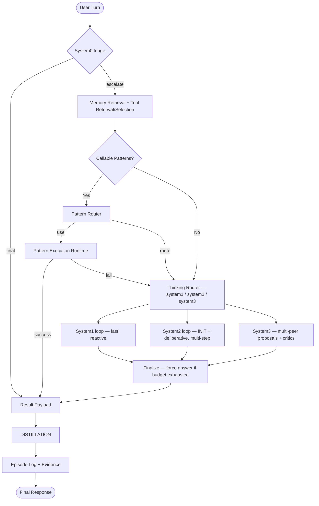

# Cognitive Mode Analysis

> Historical analysis: the implementation now includes completion checks, durable
> continuation, mutation journaling, and provisional learning. See
> [Cognition reliability](docs/cognition-reliability.md) for the current behavior.
> The weaknesses and code locations below describe the earlier implementation.

## Architecture Overview

The cognitive mode (`_run_cognition_loop`) is a **multi-phase, single-turn reasoning pipeline** that transforms a raw user turn into a grounded response. Every turn flows through these sequential phases:



---

## Primary Weakness — The Distillation Step Has No Ground-Truth Verifier

> [!CAUTION]
> This is the single most structurally fragile point in the entire pipeline.

### What the weakness is

The distillation step asks the **same model that just executed the episode** to introspect and extract durable knowledge from its own trace. There is **no independent verifier** that checks whether the distilled artifacts actually reflect what happened. This creates a **self-confirming hallucination loop**:

1. A model executes an episode and produces result `R`.
2. The same model is then asked: *"What reusable skills and patterns did this run demonstrate?"*
3. The model can invent plausible-sounding skills or patterns that were **never actually exercised** during the run, because the distillation prompt contains truncated traces and the model fills gaps with priors.
4. These invented skills and patterns pass the confidence filter (the model assigns them `confidence ≥ 0.55`) and are **written permanently to the catalogs** (`cognition_skills.json`, `cognition_patterns.json`, `cognition_lessons.json`).
5. Future turns **retrieve these artifacts from memory** and include them in the router and pattern-router prompts, treating them as trusted established knowledge.

### Why the confidence filter doesn't fix it

The `_cognition_distill_min_confidence` gate (default `0.55`) filters on **the model's own self-assessment**. A model that is confidently wrong will assign `confidence: 0.8` to a hallucinated skill. The filter has no access to tool execution logs, actual return values, or ground-truth outcomes — it only sees what the model reports.

### Compounding effects

| Effect | Mechanism |
|--------|-----------|
| **Catalog pollution** | Bad skills accumulate; the upsert logic merges by `skill_id`/`pattern_id` name, so a hallucinated entry that has the same ID as a real one will silently overwrite it |
| **Pattern rot** | A pattern with invalid Python source passes the `ast.parse` validation if the syntax is valid but semantics are wrong — it will fail only at runtime |
| **Positive feedback** | Future `pattern_route` calls score this poisoned pattern as applicable → it gets selected → it fails → a `failure_lesson` is distilled about why it failed, but the original bad skill may not be removed |
| **Memory contamination** | `memory_facts` from distillation are stored via `_memory.store_fact` and flow into every future INIT + System2 context, anchoring wrong beliefs in perpetuity |

### The real-world trigger

This weakness is most likely to fire on **budget-exhausted turns**. When the action budget is consumed before a clean final answer, the code adds a conservative note to the distillation prompt — but the model still sees a partial, incomplete observation trace and must decide what to distill. Budget-exhausted episodes are the hardest to reason about correctly and the most likely to produce fabricated lessons.

---

## The Distillation Step — Thorough Explanation

Distillation in this system has **two distinct mechanisms** operating at different timescales. Understanding both is essential.

---

### Mechanism 1 — Episodic Cognition Distillation (per-turn)

This is the primary, expensive distillation that runs after each turn that is not explicitly skipped.

#### 1A. Trigger Conditions (lines 7732–7770)

Before distillation runs, successful pattern executions are excluded:

```python
_pattern_success = route_mode == "pattern" and result_payload.get("type") == "final"
```

- **Pattern success skip**: If a stored pattern executed cleanly and returned a `final` result, distillation is skipped. The logic: *the pattern already encodes the knowledge; distilling again would be redundant and would risk polluting clean pattern entries with noise*.
- System0 answers are still eligible for distillation; triviality is decided by the System0 model rather than by text length or keyword heuristics.
- **Budget-exhausted flag**: If the action budget was consumed with no result, a `budget_exhausted=True` flag is passed, which prepends a conservative instruction to the prompt telling the model to prefer `failure_lessons` over skills/patterns.

#### 1B. Prompt Construction (`_build_cognition_distill_prompt`, line 3010)

The distillation prompt is a structured assembly of five sections:

```
COGNITION DISTILLATION

After the episode, distill reusable knowledge from the run.

Respond with STRICT JSON only:
{"type":"distill",
 "reusable_skills":[{"name":"...","description":"...","when_to_use":["..."],"confidence":0.0}],
 "memory_facts":[{"name":"...","value":"...","confidence":0.0}],
 "patterns":[{"pattern_id":"...","name":"...","description":"...","when_to_use":["..."],
              "source":"def pattern_name(arg1, arg2=...):\n    ...\n    return result","confidence":0.0}],
 "failure_lessons":[{"lesson":"...","when":"...","confidence":0.0}],
 "safety_rules":[{"rule":"...","rationale":"...","confidence":0.0}]}

Rules: ...
Pattern source rules: ...

RESULT:
<truncated result_payload JSON, max 1600 chars>

QUERY STATE / STATE OF MIND:
<formatted query_state and state_of_mind>

OBSERVATIONS:
<formatted tool call observations>

THINKING TRACE:
<truncated thinking_trace JSON, max 3200 chars>
```

Notice what is **not included** but previously was (commented-out code at lines 3044–3047):
```python
#"AVAILABLE TOOLS:\n"
#f"{self._format_tools_for_agent(tools)}\n\n"
#"CALLABLE PATTERNS:\n"
#f"{self._format_cognition_callable_patterns_brief(patterns)}\n\n"
```
The available tools and existing callable patterns were deliberately removed from the distillation context. The intent was to reduce context size, but this also means the model **cannot cross-check** whether a pattern it wants to distill would match tools that actually exist.

#### 1C. LLM Invocation and Repair (lines 7030–7053)

```python
raw = await self._generate_cognition_response(prompt, trace_id, turn_id)
parsed = self._parse_cognition_distill_response(raw)
if parsed is None:
    # First parse failed → attempt JSON repair
    repair_prompt = self._build_json_repair_prompt(distill_schema, raw)
    repaired = await self._generate_cognition_response(repair_prompt, trace_id, turn_id)
    parsed = self._parse_cognition_distill_response(repaired)
if parsed is None:
    # Both attempts failed → return empty distillation
    return {"reusable_skills": [], "memory_facts": [], ...}
```

Two LLM calls are made in the worst case. The model override for distillation follows the same `_cognition_thinking_model` used for reasoning steps (no dedicated distillation model is configured separately).

#### 1D. Parse and Normalize (`_parse_cognition_distill_response`, line 5200)

The raw JSON is validated against `type == "distill"` and then each array is individually normalized:

| Array | Normalizer | Key fields |
|-------|-----------|------------|
| `reusable_skills` | `_normalize_cognition_skill` | `name`, `description`, `when_to_use`, `confidence` |
| `memory_facts` | inline | `name`, `value`, `confidence` |
| `patterns` | `_normalize_cognition_pattern` | `pattern_id`, `source` (must pass `ast.parse`), `confidence` |
| `failure_lessons` | `_normalize_cognition_lesson` | `lesson`, `when`, `confidence` |
| `safety_rules` | `_normalize_cognition_safety_rule` | `rule`, `rationale`, `confidence` |

Each array is capped at **8 items max** after normalization. Patterns additionally undergo Python `ast.parse` validation — if the `source` field contains a syntax error, the pattern is rejected entirely.

#### 1E. Confidence Filter (`_persist_cognition_distillation`, line 7056)

```python
_min_conf = self._cognition_distill_min_confidence  # default: 0.55
reusable_skills = [s for s in reusable_skills if float(s.get("confidence", 0)) >= _min_conf]
patterns      = [p for p in patterns if ...]
failure_lessons = [l for l in failure_lessons if ...]
safety_rules  = [r for r in safety_rules if ...]
memory_facts  = [f for f in memory_facts if ...]
```

Items below the threshold are silently discarded. The threshold is configurable in `settings.json` under `orchestrator.cognition_distill_min_confidence`.

#### 1F. Catalog Upsert (`_upsert_cognition_catalog`)

Each surviving item is upserted into its JSON file catalog:
- `cognition_skills.json` — keyed by `skill_id`
- `cognition_patterns.json` — keyed by `pattern_id`
- `cognition_lessons.json` — keyed by `lesson_id`
- `cognition_safety_rules.json` — keyed by `rule_id`

The upsert returns a list of **changed** entries only (new or updated). Changed entries are then:

#### 1G. Memory Persistence

```python
for skill in changed_skills:
    await self._memory.store_entity(skill_id, skill, trace_id, confidence=...)
for pattern in changed_patterns:
    await self._memory.store_entity(pattern_id, pattern, trace_id, confidence=...)
# etc.
```

Skills, patterns, lessons, and rules are written to the semantic memory store as entities. `memory_facts` are written as key-value facts via `store_fact`, with a duplicate-check: if an exact `(name, value)` pair already exists in memory, it is not stored again.

#### 1H. Episode Log

Regardless of whether distillation ran or was skipped, the full episode is appended to `cognition_episodes.jsonl`:

```json
{
  "ts": "...",
  "task": "<raw user text>",
  "thinking_mode": "system2",
  "execution_mode": "system2",
  "query_state": {...},
  "state_of_mind": {...},
  "observations": [...],
  "thinking_trace": [...],
  "result": {...},
  "distillation": {...},
  "persisted_counts": {"skills": 1, "facts": 0, "patterns": 0, "lessons": 0, "safety_rules": 0}
}
```

This is the ground-truth audit log for every turn.

---

### Mechanism 2 — Exchange (Conversation) Distillation (periodic)

This is a lighter-weight distillation that runs **every N turns** (`memory_distill_turns`, default: 12).

#### Flow (`_store_episodic_and_maybe_distill`, line 1639)

1. Every turn stores a compact `"user_text | assistant_text"` string as an episodic memory entry with `name="conversation.turn"`.
2. When the episodic store accumulates `memory_distill_turns` entries, they are fetched as a batch.
3. A simpler prompt extracts **facts** (stable preferences, identities, decisions) and **entities** (structured objects like users, projects, devices) from the raw conversation batch.
4. Distilled facts → `store_fact`. Distilled entities → `store_entity`.
5. The raw episodic batch entries are **deleted** after distillation succeeds, keeping the episodic store lean.

This mechanism focuses purely on **user/world facts** (e.g., `user.name`, `user.os`, `project.owner`) rather than operational knowledge like skills and patterns. It uses the general `model.Generate` call (not the specialized cognition model override) and has no confidence filter — all extracted facts are stored directly.

---

## Summary Table

| Distillation Type | Trigger | Output | Storage |
|------------------|---------|--------|---------|
| Episodic cognition distill | Every post-reasoning turn unless explicitly skipped | skills, patterns, facts, lessons, safety_rules | JSON catalogs + semantic memory |
| Exchange conversation distill | Every 12 turns (configurable) | facts, entities | Semantic memory (facts + entities) |
